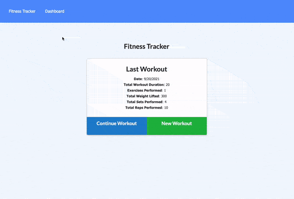

# fitnessTracker
Fitness tracker application to create, view, and track daily workouts

  

  

  

  

  

  

  ## Table of contents
* [Description](#description)
* [Technologies Used](#technologies-used)
* [Installation](#installation)
* [Usage](#usage)
* [Credits](#credits)
* [Questions](#questions)      
* [License](#license)

## Description
This is a fitness tracker that allows the user to enter data about workouts and see a log of recent workouts, as well as data such as total duration of workouts, total sets, total weight. This application connects to a MongoDB Atlas database to work with the data.

## Technologies Used
HTML  
CSS  
JavaScript  
Node.js  
Express.js  
Mongoose  
Morgan  
      
      
## Installation

1. Provided that you have a code editor of your choosing installed on your system, such as VS Code (https://code.visualstudio.com/),

2. Provided that you have a Terminal installed for Windows (https://www.microsoft.com/en-us/p/windows-terminal/9n0dx20hk701?rtc=1&activetab=pivot:overviewtab) or are using a Mac with Terminal installed with the OS,

3. You have Git and Github Desktop installed (https://git-scm.com/downloads, https://desktop.github.com/) and have registered for an account,

4. Clone this repository:
git clone https://github.com/bpplaysguitar/fitnessTracker.git,

5. Create your own repository for the files on GitHub.

6. Edit in your code editor and continue to commit, push changes and perform other Git actions using your repository https://docs.gitlab.com/ee/gitlab-basics/start-using-git.html.

7. Use Heroku to deploy. See http://www.heroku.com for how to get started.
      

## Usage
Screenshot and video of application in use

 
Use the buttons to create a new workout, continue a workout, or view the dashboard to see data about your workouts.

      
## Credits
Professional README guide template provided by Coding Boot Camp. https://github.com/coding-boot-camp

## Questions
For questions about this project, I can be reached at brianpalay@gmail.com.